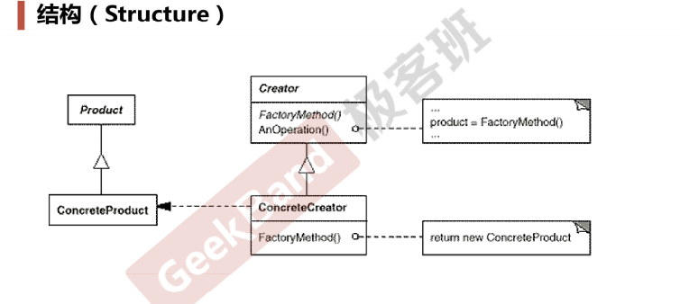

# 设计模式

## <a name="index"/> 目录

* [工厂模式](#factory)
* [抽象工厂模式](#abstract_factory)

## <a name="factory"/> 工厂模式

> 工厂只依赖抽象，不依赖具体。但，并不是把变化消灭，只是把变化赶到一个局部的地方。

  把变化当作一只猫，把ta关到笼子里，而不是让其在代码里跳来跳去。
  
* 定义一个用于创建对象的接口
* 让子类决定实例化哪个类
* 工厂方法`Factory Method`将类的实例化延迟（目的：解耦，手段：虚函数）到子类。

> 解决的是“单个对象”的需求变化，缺点在于要求创建方法/参数相同

** UML结构关系图 **

## <a name="abstract_factory"/> 抽象工厂模式

-  在软件系统中，经常面临着“一系列相互依赖的对象”的创建工作；同时，由于需求的变化，往往存在更多系列对象的创建工作。
-  如何应对这种变化？如何绕过常规的对象创建方法（new），提供一种“封装机制”来避免客户程序和这种“多系列具体对象创建工作”
   的紧耦合？
   

* 定义一个用于创建对象的接口
* 让子类决定实例化哪个类
* 工厂方法`Factory Method`将类的实例化延迟（目的：解耦，手段：虚函数）到子类。

> 解决的是“单个对象”的需求变化，缺点在于要求创建方法/参数相同

** UML结构关系图 **

//TODO 待完善