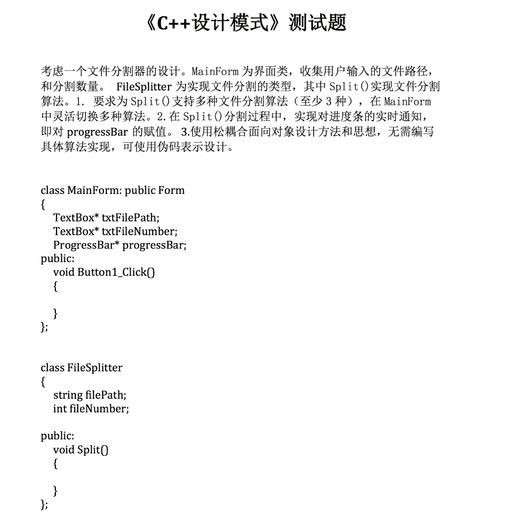

# 设计模式第一周

## <a name="index"/> 目录

* [问题](#question)
* [题解及运行结果](#answer)

## <a name="question"/> 问题
> 考虑一个文件分割器的设计。`MainForm` 为界面类，收集用户输入的文件路径和分割数量。
`FileSpliter`为实现文件分割的类型，其中`Split()`实现文件分割算法：

- [x] 1. 要求为`Split()`支持多种文件分割算法（至少3种），在`MainForm`中灵活切换多种算法
- [x] 2. 在`Split()`分割过程中，实现对进度条的实时通知，即对`processBar`的赋值
- [x] 3. 使用松耦合面向对象设计方法和思想，无需编写具体算法实现，可使用伪码表示设计

具体问题，参考[附录1](#ps1)

## <a name="answer"/> 题解

### 思路
 
* 针对`1`的要求，可以采用策略模式
* 针对`2`的要求，应该采用观察者模式
* 针对`3`的要求，松耦合，不强关联

### 解答

* 参考代码

## <a name="ps1"/>附录1

