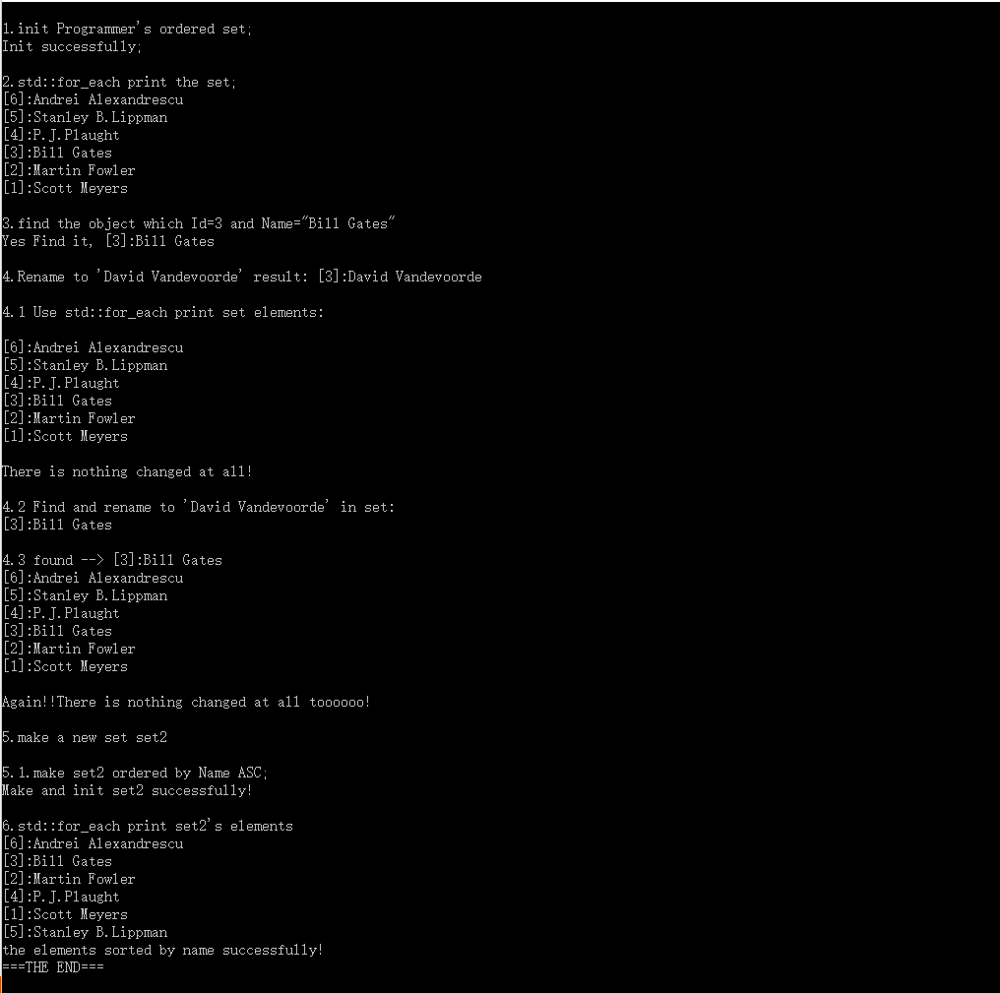

## STL相关问题及笔记

## <a name="index"/> 目录

* [坑](#keng)
* [问题列表](#question)
* [题解及运行结果](#workresult)

<a name="keng"/>
### 0.坑

> 碰到模板模板参数编译问题 VS2016 C4180，原来是不能实例化为对象只能实例化为模板 
> set第二个参数只能是 MyLess<MyType> 不能是 MyLess<MyType>() ，切忌。

<a name="question"/>
### 1.问题列表：

<a name="workresult"/>
### 2.解题及运行结果

代码在VS2015下编译通过

* 结果，使用了两种方式修改
 * 1.查到元素，*it.setName(newName)，修改失败，修改的是set元素的一份copy，所以对set无影响
 * 2.查到元素，并在算法functor里面修改（FindAndModifyProgrammer），修改失败，迭代器中不允许修改
 * 3.查到元素，const_cast<Programmer&>(*it).setName(newName)，成功！ 

